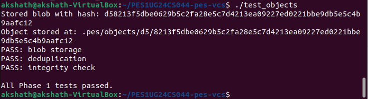
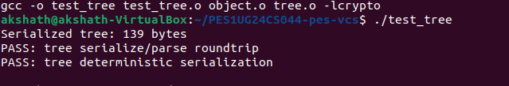
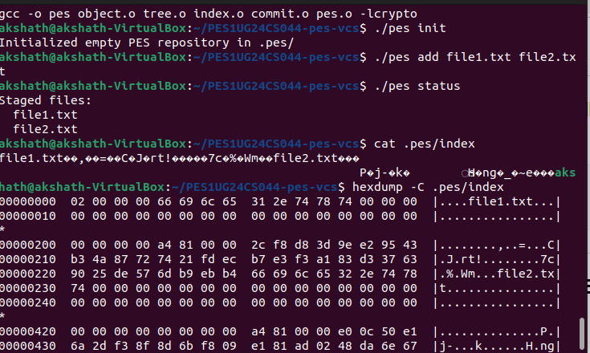
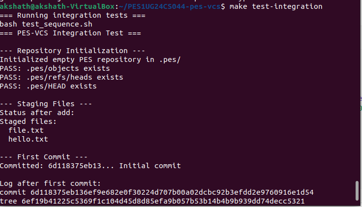
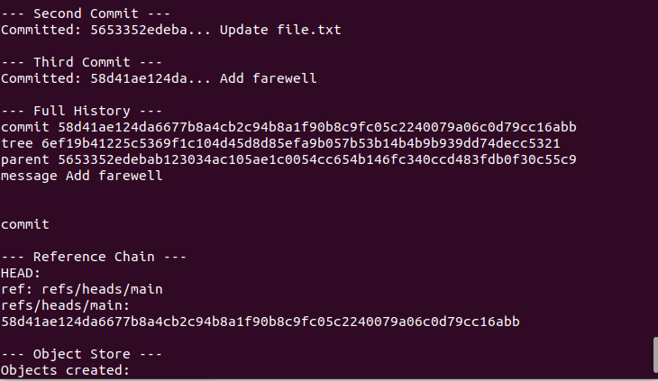
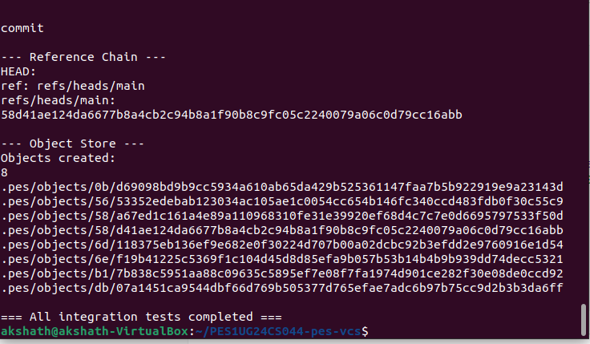

# PES-VCS Lab Report

**Name:** Akshath Patil
**SRN:** PES1UG24CS044
**Platform:** Ubuntu 22.04

---

## Build Instructions

```bash
sudo apt update && sudo apt install -y gcc build-essential libssl-dev
export PES_AUTHOR="Akshath Patil <PES1UG24CS044>"
make all
```

---

## Phase 1 — Object Storage Foundation

**Files modified:** `object.c`

`object_write` creates objects in the format `<type> <size>\0<data>`, computes SHA-256 hash using `compute_hash`, ensures deduplication, and writes data atomically using temp file + rename.

`object_read` reads stored objects, verifies integrity using hash comparison, parses header, and returns the data.

### Screenshot — Object Storage Test



---

## Phase 2 — Tree Objects

**Files modified:** `tree.c`

`tree_from_index` constructs directory structure from index entries, handles nested paths recursively, and stores tree objects.

### Screenshot — Tree Test Output



---

## Phase 3 — Index (Staging Area)

**Files modified:** `index.c`

* `index_load` reads `.pes/index`
* `index_save` writes index safely
* `index_add` stages files

### Screenshot — Index and Status



---

## Phase 4 — Commits and History

**Files modified:** `commit.c`

`commit_create`:

* Builds tree from staged files
* Reads parent commit
* Stores commit object
* Updates HEAD

### Screenshot — Commit Log



### Screenshot — Object Store Growth



### Screenshot — HEAD & Branch



---

## Phase 5 — Branching and Checkout

### Q5.1 — Checkout Implementation

* Update `.pes/HEAD`
* Load commit from branch
* Update working directory
* Handle conflicts

### Q5.2 — Dirty Check

* Compare working files with index
* Use metadata + hashing

### Q5.3 — Detached HEAD

* HEAD points to commit
* Commits not linked to branch
* Recovery by creating branch

---

## Phase 6 — Garbage Collection

### Q6.1 — Mark and Sweep

* Traverse from HEAD
* Mark reachable objects
* Delete unreachable

### Q6.2 — Race Condition

* GC may delete objects during commit
* Git avoids using safe writes

---

## Conclusion

This project demonstrates Git internals:

* Content-addressable storage
* Tree structure
* Index staging
* Efficient version tracking
